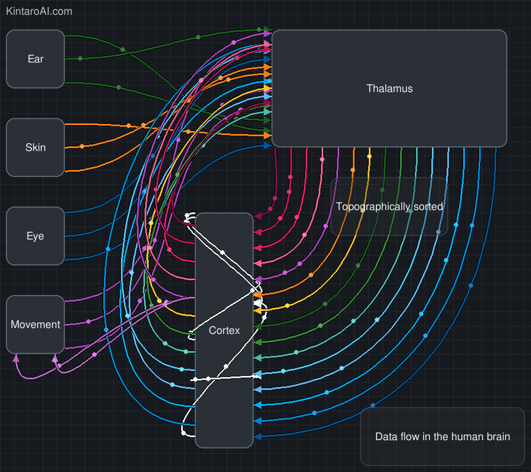

# Neuro Flow — Animated Blocks & Curved Arrows

**Interactive, animated flow diagrams** that you can drag around in real-time.
Two flavors:

* **Python / Pygame** app for desktop.
* **HTML + SVG + JS** drop-in for the browser (multiple diagrams per page, zero deps).



---

## What it looks like

* Rounded blocks with multi-line labels.
* Smooth cubic Bézier connections with arrowheads.
* Spark “impulses” that travel along connections to show direction.
* Live dragging of nodes; curves and sparks update instantly.
* Arrowheads terminate **outside** the target block border for a clean look.

---

## Contents

```
.
├── README.md          # this file
├── output.gif         # preview (example animation)
├── python/
│   └── neuro_flow.py  # Pygame version (CLI options; can export frames)
└── web/
    └── index.html     # Browser version (drop-in `run_blocks` library + demo)
```

---

## Features

* **Draggable nodes** with snapping-friendly anchors on each edge.
* **Curved arrows** with configurable width and control-point tuning.
* **Arrowheads** aligned with path tangents; tips land outside the box.
* **Sparks** in two modes:

  * *Classic*: evenly spaced, looping.
  * *Emitter*: randomly spawned particles with caps and multipliers.
* **Multi-line labels** (`<br/>` or `\n`) remain centered while dragging.
* **Frame export** (Python) to build GIFs/MP4s.
* **Multi-instance rendering** (Web) — create many diagrams on one page.

---

## Quick Start — Python (Pygame)

### 1) Install

```bash
python -m venv .venv
source .venv/bin/activate            # Windows: .venv\Scripts\activate
pip install pygame
```

### 2) Run

```bash
python python/neuro_flow.py
```

### 3) Export frames (optional)

```bash
python python/neuro_flow.py \
  --save-prefix frames/frame_ \
  --frame-skip 2 \
  --max-frames 600
```

Then stitch frames into a GIF (example, using ImageMagick):

```bash
magick -delay 3 -loop 0 frames/frame_*.png output.gif
```

### Notable CLI flags

* `--random-spark-starts` — enable emitter mode (randomly spawned sparks).
* `--emit-mult <float>` — scale emitter spawn rate.
* `--max-live-sparks <int>` — cap concurrent sparks per connection.
* `--frame-skip <int>` — save every Nth frame (export).
* `--max-frames <int>` — stop after N saved frames (export).

---

## Quick Start — Web (HTML + JS + SVG)

Open `web/index.html` in your browser. It includes a tiny “library” and example usage.

To embed in your own page:

```html
<div id="diagram-1" style="height:620px"></div>
<script>
  // run_blocks(containerSelector, builderCallback, options?)
  run_blocks("#diagram-1", (b) => {
    // Blocks
    b.addBlock("A", 390,  30, 220, 80, "Motor Cortex");
    b.addBlock("B", 390, 130, 220, 80, "Corticospinal Tract");
    // ...

    // Connections
    b.connect({
      start: { block:"A", edge:"bottom", t:0 },
      end:   { block:"B", edge:"top",    t:0 },
      width: 3, sparks: 3, sparkSpeed: 0.8, color: b.colors.motor
    });
    // ...
  }, { width: 1000, height: 620 });
</script>
```

### Multiple diagrams on one page

Just call `run_blocks` again with another container:

```js
run_blocks("#diagram-2", (b) => {
  b.addBlock("X", 60, 40, 160, 60, "Input");
  b.addBlock("Y", 300, 40, 160, 60, "Processor");
  b.connect({ start:{block:"X",edge:"right",t:0}, end:{block:"Y",edge:"left",t:0}, width:3, sparks:2, color:b.colors.sens2 });
}, { width: 760, height: 360 });
```

---

## Web API (builder `b`)

```ts
run_blocks(container: string | HTMLElement, build: (b: Builder) => void, options?: {
  width?: number;     // default 1000 (viewBox width)
  height?: number;    // default 720  (viewBox height)
  grid?: boolean;     // default true  (background grid)
}): Builder
```

### Builder methods

* `b.addBlock(id, x, y, w, h, label)` → `Block`
* `b.block(id)` → lookup a block instance
* `b.connect(options)` → create a connection
* `b.update()` → recompute all paths (called automatically on drag)
* `b.start()` / `b.stop()` → control the animation loop
* `b.colors` → color palette (CSS `rgb(...)` strings)
* `b.const` → `{ CONTROL_PUSH_MAX, CONTROL_PUSH_RATIO }`
* `b.svg` → underlying `<svg>` element, if you need to add adornments

### Block edges & anchors

Each edge supports a `t` offset in `[-0.5, 0.5]`:

* `start: { block:"A", edge:"left|right|top|bottom", t: 0.0 }`
* `end:   { block:"B", edge:"...", t: 0.25 }`

### Connection options

```ts
{
  start: { block: string, edge: "left"|"right"|"top"|"bottom", t: number },
  end:   { block: string, edge: "left"|"right"|"top"|"bottom", t: number },
  width?: number,          // stroke width (px)
  color?: string,          // CSS color e.g. "rgb(171,71,188)"
  className?: string,      // alternative to color; use your own CSS class
  sparks?: number,         // # of spark dots
  sparkSpeed?: number,     // 0..1 typically
  emitter?: boolean,       // random spawn mode (else classic loop)
  maxLive?: number,        // cap concurrent sparks in emitter mode
  outOffset?: number       // nudge arrow tip outside target block (px), default 12
}
```

---

## Customization Tips

* **Colors**: `b.colors` gives you a palette; pass `color: b.colors.sens2` or provide your own CSS class via `className`.
* **Sparks**: increase `sparks` or `sparkSpeed` for denser/faster impulses. Use `emitter: true` for stochastic effects.
* **Curves**: tune `b.const.CONTROL_PUSH_RATIO` (0–0.5 sweet spot) and `CONTROL_PUSH_MAX` for long cables.
* **Arrow placement**: per-connection `outOffset` (default `12`) controls how far outside the target block the arrowhead lands.

---

## Generating `output.gif`

* **Python path**: export frames with `--save-prefix`, then combine with ImageMagick (see above).
* **Web path**: use a screen recorder, or add a small capture button that draws the SVG onto a `<canvas>` per frame (optional enhancement).

---

## Known Notes / Nice-to-haves

* Optional **snap-to-grid** and **guides** when dragging.
* JSON **schema import/export** for diagrams.
* Export **PNG/SVG** directly from the web version (easy to add).

---

## License

MIT (feel free to adapt for your own projects).
